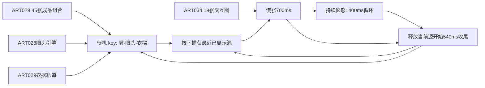

# ART-035 · 已认可动作原生集成交接

用户在 ART034 演示后回复“可以推进”，PM确认本次嘟嘴、怒筋及展示观感通过。素材固定于 `2c31b27c99550f9002662cfb6f55181bd9fc0deb`；本轮仅整理这份文档及 `art035-handoff.json`，0生成、0像素修改、0PNG重编码。此清单不是生产manifest或新共享契约。

## 选择性复制

JSON的 `assets` 是完整、可逐项选择性复制的64条清单：每项有仓库相对path、语义key、SHA256、字节数、重复字节key。45张来自 `art029-frames/`，19张来自 `art034-frames/`；所有图均已嵌入ART034演示的新版images表并逐字节对应。不要复制修改前oldImages表。

共60种不同PNG字节，4组各两条重复：A-open-base/normal-normal-A、B-open-base/normal-normal-B、C-open-base/normal-normal-C、B-half-base/normal-half-B。生产存储可讨论去重，但64个语义key不能丢失。transition C/H仅是ART033旧图的历史字节来源，本次复制ART034目录中的现成别名即可，不额外复制ART033目录。

仅从固定素材提交提取上述路径；不要合并整个ART分支，不复制该分支历史正式frames/manifest，不让旧0.2候选回流。运行素材不需要生成donor、合成脚本或全部历史检查记录。`referenceFiles`列出的脚本、timing、delivery、demo供DEV提案追溯，不作为生产加载格式。文本SHA同时记录工作区字节和固定提交Git blob字节，避免CRLF转换误报；PNG SHA是原文件字节。

## 待机组合与轨道

key为 `idle:{A|B|C}-{open|half|closed|mid|wink}-{base|light|upper}`，3×5×3=45张完整图。mid是wink进入/回正时的头眼中间姿态，half是普通眨眼半闭；两者不能混用。全部使用同一96×104画布，现有坐标锚点(48,94)，无需平移或重编码。

| 轨道 | 半开区间（ms）→图值 |
| --- | --- |
| 轻扇1400循环 | 0–400 A；400–550 B；550–700 C；700–1100 C；1100–1250 B；1250–1400 A |
| 衣摆1400循环 | 0–400 base；400–550 light；550–1200 upper；1200–1350 light；1350–1400 base |
| 普通眨眼240 | 0–60 half；60–140 closed；140–200 half；200–240 open |
| wink1200 | 0–250 mid；250–700 wink；700–1050 mid；1050–1200 open |

翼与衣摆用同一待机局部时钟；衣摆回落延迟翼100ms，无独立随机触发。wink为画面左眼、同侧轻歪头，随机等待源码为 `50000+floor(random()*20000)`，即50000–69999ms；完成时从计划结束时刻重新抽样。wink和普通眨眼互斥，开始wink时停普通眨眼，完成后重排普通眨眼；翼和衣摆继续。迟到采样在当前采样时刻开始wink，不追播所有错过事件。

普通眨眼初始等待4000ms，结束被采样到时再等4000ms；源码明确“4秒仅演示”。这里记录真实演示行为，**不冻结生产眨眼频率**，也不恢复旧15秒双眼笑脸。

ART029独立演示的drag仅让眼回正/衣摆base，释放重新安排眼事件，翼/衣摆继续全局相位。ART034完整交互覆盖该包装：panic/held/release期间不采样待机wink引擎，release完成时新建眼引擎、待机时钟从releaseStart+540重启，翼/衣摆归周期起点。原生提案应以ART034这一组合行为为依据，避免直接照搬ART029孤立drag包装。

## 交互映射

| 状态 | 持续或边界 | 实际图key（pose前缀） |
| --- | --- | --- |
| panic | 0–60 | 最近实际赋给图像控件的源图原样 |
| panic | 60–200 / 200–340 | left-panic-B / right-panic-C |
| panic | 340–480 / 480–620 | left-panic-A / right-panic-B |
| panic | 620–700 | transition-annoyed-C（无怒筋旧图别名） |
| held | 0–400 / 400–550 / 550–1100 / 1100–1250 / 1250–1400 | annoyed-annoyed-A / B / C / B / A；不断循环直到释放 |
| release | 0–60 | 释放前实际显示源原样，不按事件时间重新采样 |
| release | 60–160 / 160–260 | 对应body/face的H / C |
| release | 260–380 | normal-half-B，怒筋在此移除 |
| release | 380–540 | idle:A-open-base，随后新待机epoch |

`interaction.releaseByCapturedKey`完整展开全部64种源图到五项PNG key和时长，所有引用均在assets中。待机源路由normal/normal；交互源按body-face-wing分解；half归normal。即使源是idle wink/闭眼/衣摆上扬，首60ms仍是原图，之后normal H/C会回正。transition-annoyed-H供620–700阶段早松用；transition C/H不含新版怒筋。恼怒A/B/C/H嘟嘴及怒筋完全一致，release的H/C保留至260ms。

任何release中重抓立即取消旧过程，重新panic；源快照仍保留60ms。因此从恼怒帧重抓的首60ms会延续已有怒筋，之后新选慌张姿态无怒筋，不应为了删除怒筋破坏实际源首图规则。眼/衣摆复位和有限翼姿态之间仍可能跳变。

源图在网页中是最近赋给img.src的PNG，**不是显示器呈现回执**。ADR004中的原生已提交帧/包代次方向可供DEV讨论，但旧0.4的16图、entrySequences及旧时长不可替代本64图映射；新manifest/版本、轨道调度与原生取消规则须PM接受提案后另行冻结。

## 尚未冻结及保留限制

- 新生产schema/package版本、资源布局、轨道调度格式、普通眨眼频率、原生快照代次/来源身份与旧回调隔离，需要PM/DEV提案决定。
- 网页pointerup/cancel/lostcapture及键盘松开触发释放；真实宿主失焦/Escape、捕获释放即停位移、换包/模式切换、无效源回退不由此网页清单擅自定义。
- 手部抬起/微屈读感偏弱、wink入口回正、衣摆回基础以及有限帧接缝保留；原翼透明点保留。用户通过本次观感不等于任意入口无缝或原生验收通过。
- 正式包/manifest/宿主未改；没有新角色设计、联动或随机漂浮。自动跟进暂停，交付后停止。

## 本轮核对

只针对交接：枚举45+19图并计算这64图及8份引用文件SHA；64条key集合与ART034实际新版嵌入表相等且PNG原字节相等；64份释放映射所有目标存在、每份540ms且首key等于源；3份引擎/轨道源码确实嵌入ART034演示。未重跑历史110文件保护/PNG格式/浏览器检查。提交前运行JSON解析、映射引用/时长检查及git diff --cached --check；结果见交付消息。
